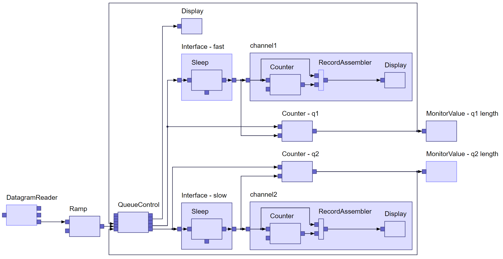

# elkjs

The [Eclipse Layout Kernel (ELK)](https://www.eclipse.org/elk/) implements an infrastructure to connect diagram editors or viewers to automatic layout algorithms. This library takes the layout-relevant part of ELK and makes it available to the JavaScript world. 
ELK's flagship is a layer-based layout algorithm that is particularly suited for node-link diagrams with an inherent direction and ports (explicit attachment points on a node's border). It is based on the ideas originally introduced by Sugiyama et al. An exmple can be seen in the screenshot below. 

You can see elkjs [live in action](https://rtsys.informatik.uni-kiel.de/elklive/) in conjunction with TypeFox's [sprotty](https://github.com/theia-ide/sprotty) diagramming framework. 

elkjs is the successor of [klayjs](https://github.com/OpenKieler/klayjs). 



# Installation
```bash
npm install elkjs
```


#  Files
The library consists of two main files: 
* `elk-api.js`: Provides the API and only the API. 
* `elk-worker.js`: Provides the code that actually knows how to lay out a graph. This is the file that is generated from ELK's Java code base using GWT.

Two further files are provided:
* `elk.bundled.js`: A bundled version of the two previous files, ready to be dropped into a browser's `<script>` tag. The file is processed by [browserify](http://browserify.org/) and the `ELK` is exposed as a global variable (if run in a browser).
* `main.js`: Main file of the node.js module. Allows to conveniently write `require('elkjs')` instead of composing the files from above.

# Example
A small example using node.js, 
for further use cases see the next section.
```js
const ELK = require('elkjs')
const elk = new ELK()

const graph = {
  id: "root",
  properties: { 'elk.algorithm': 'layered' },
  children: [
    { id: "n1", width: 30, height: 30 },
    { id: "n2", width: 30, height: 30 },
    { id: "n3", width: 30, height: 30 }
  ],
  edges: [
    { id: "e1", sources: [ "n1" ], targets: [ "n2" ] },
    { id: "e2", sources: [ "n1" ], targets: [ "n3" ] } 
  ]
}

elk.layout(graph)
   .then(console.log)
   .catch(console.error)
```

You can use _layout options_ to configure the layout algorithm.
For that you atttach a `properties` obejct
to the graph element that holds key/value pairs with the layout 
options. See, for instance, `root` in the example above. 
It is possible to only use the suffix of a layout option: 
`algorithm` instead of `org.eclipse.elk.layered`. 
However, if the suffix is not unique the layout option 
may be ignored. If you want to be save, you can start the
layout options with the `elk.` part.  
A list of all options and further details of their exact effects 
is available in [ELK's documentation](http://www.eclipse.org/elk/reference.html).


# Usage

Since laying out diagrams can be a time-consuming job
(even for the computer),
and since we don't want to freeze your UI, 
Web Workers are supported out of the box.
The following examples illustrate how the library can be used either
with and without a Web Worker. 

## node.js

```js
const ELK = require('elkjs')
// without web worker
const elk = new ELK()

elk.layout(graph)
   .then(console.log)
```

```js
const ELK = require('elkjs')
// with web worker
const elk = new ELK({
  workerUrl = './node_modules/elkjs/lib/elk-worker.min.js'
})

elk.layout(graph)
   .then(console.log)
```

Note that node.js doesn't come with a Web Worker out of the box.
Thus, we have to use a library for it and selected `webworker-threads` as default.
Any other library that provides the standard Web Worker methods should be fine though. 

## Browser

```html
<html>
  <script src="./elk.bundled.js"></script>
  <script type="text/javascript">
    const elk = new ELK()

    elk.layout(graph)
       .then(function(g) {
         document.body.innerHTML = "<pre>" + JSON.stringify(g, null, " ") + "</pre>"
       })
  </script>
</html>
```

```html
<html>
  <script src="./elk-api.js"></script> <!-- use elk-api.js here! -->
  <script type="text/javascript">
    const elk = new ELK({
      workerUrl: './elk-worker.js'
    })

    elk.layout(graph)
       .then(function(g) {
         document.body.innerHTML = "<pre>" + JSON.stringify(g, null, " ") + "</pre>"
       })
  </script>
</html>
```

## Typescript
```ts
import ELK from 'elkjs/lib/elk.bundled.js'
const elk = new ELK()


import ELK from 'elkjs/lib/elk-api'
const elk = new ELK({
  workerUrl: './elk-worker.min.js'
})
```


# API

The elkjs library provides a single object: the `ELK`. The `ELK` has a constructor that can be used 
to construct it:
* `new ELK(options)` - the `ELK` can be fed with options, all of which are optional:
  * `defaultLayoutOptions` - an object with default layout options specified as key/value pairs
        that are used if no further layout options are passed to the `layout(graph, options)` method (see below). Default: `{}`.
  * `algorithms` - an array of algorithm ids (only the suffix). Default: `[ 'layered', 'stress', 'mrtree', 'radial', 'force' ]`.
  * `workerUrl` - a path to the  `elk-worker.js` script. As a consequence the `ELK` will use a Web Worker to execute the layout. Default: `undefined`.

Apart from that the `ELK` offers the following methods:
* `layout(graph, options)`
  * `graph` - the graph to be laid out in [ELK JSON](http://www.eclipse.org/elk/documentation/tooldevelopers/graphdatastructure/jsonformat.html). Mandatory!
  * `options` - a configuration object. Currently its sole purpose is to pass _global_ layout options. 
    That is, layout options that are applied to every graph element unless the element specifies the option itself. Optional.
  * returns a `Promise`, which passes either the laid out graph on success or a (hopefully helpful) error on failure.
* `knownLayoutOptions()`
  * returns an array of of known layout options. For each options additional information
    such as its `id` and `group` is given.
* `knownLayoutAlgorithms()` 
  * returns an array of registered layout algorithms (see above) 
    alongside further information about each algorithm.
* `knownLayoutCategories()`
  * returns an array of registered layout categories.
* `terminateWorker()` - in case a Web Worker is used, the worker's `terminate()` method is called.

The three methods starting with `known` basically return information 
that, in the Java world, would be retrieved from the [`LayoutMetaDataService`](http://www.eclipse.org/elk/documentation/algorithmdevelopers/metadatalanguage.html).


# Building

For building, a checkout of the [ELK](https://github.com/eclipse/elk) repository is required
and should be located in the same directory as the checkout of this repository. 
Currently, we also require a checkout of a particular branch 
of the [emfgwt](https://github.com/Axellience/emfgwt) repository: `feature/check-2.12`.

```bash
npm install
npm run build
```

Afterwards you can find the created files in the `lib` folder. 

# Thanks 

* [@automata](https://github.com/automata) for the very first `klayjs` version
* [@aranega](https://github.com/aranega) for making emfgwt work for us
* [@EyMaddis](https://github.com/EyMaddis) for valuable API discussions
* The team working on the layout algorithms
  * [@spoenemann](https://github.com/spoenemann)
  * [@le-cds](https://github.com/le-cds)
  * [@uruuru](https://github.com/uruuru)
  * [@eNBeWe](https://github.com/eNBeWe)
  * the vast number of students that contributed to ELK
